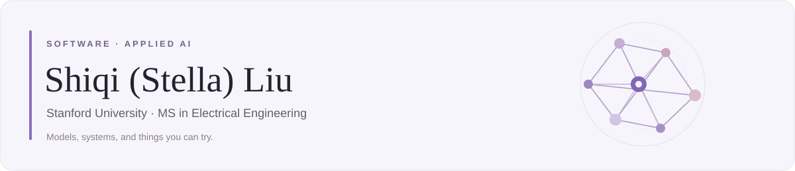

[Email](mailto:shiqiliu@stanford.edu) · [LinkedIn](https://www.linkedin.com/in/shiqi-liu-stella) · [Interactive Calendar Demo](https://stella-67.github.io/done-web-demo/) · [LLM Interpretability Blog](https://transcoder-reasoning.liushiqiiiiii.chatgpt.site/) · [ConverseNet](https://github.com/cszn/ConverseNet)

I'm a **master's student in Electrical Engineering at Stanford**. My work spans LLM interpretability, reusable image-restoration code, and an iOS app for recording and reflecting on everyday life.

**Open to Summer 2027 internships in software and ML engineering.**

## Selected work

### 01 · Done — time tracking & reflection

An iOS app that brings timelines, interruption tracking, and activity reflection into one place. Its LLM assistant uses structured tools to query schedules and manage events and to-dos, with persistent conversation history and user confirmation for deletions.

**Swift · SwiftUI · UIKit · Supabase · LLM tool calling**

[**Try the calendar demo →**](https://stella-67.github.io/done-web-demo/)

---

### 02 · Understanding what happens inside LLMs

PyTorch pipelines for sparse transcoders, cross-layer feature analysis, and causal interventions on **Gemma-3-4B-IT**. The work includes a dataset of **6.4M QA pairs / 5.5B tokens** and activation extraction across **34 transformer layers**.

**Python · PyTorch · LLM interpretability · Model evaluation**

[**Explore the technical blog →**](https://transcoder-reasoning.liushiqiiiiii.chatgpt.site/)

---

### 03 · Reverse Convolution

**ICCV 2025 · Official open-source implementation · 100+ GitHub stars**

A reusable reverse-convolution operator for image restoration, with an end-to-end deblurring pipeline and modular evaluation across restoration tasks, blur kernels, and degradation settings.

[**Code →**](https://github.com/cszn/ConverseNet) · [**Paper →**](https://arxiv.org/abs/2508.09824)

---

### 04 · Generative AI Privacy & Adversarial Optimization

A hierarchical adversarial-optimization pipeline for protecting facial privacy against customized text-to-image models. I implemented reward-guided optimization and evaluation workflows to assess robustness under malicious model fine-tuning.

**Generative AI · Adversarial Optimization · Privacy · Robustness Evaluation**

[**Read the Anti-aesthetics paper →**](https://arxiv.org/abs/2504.12129)

## Skills

LLM Interpretability · LLM Tool Calling · Model Evaluation · Machine Learning  
Data Pipelines · Data Structures & Algorithms · iOS Development · API Integration

Outside of code: travel, languages, and cats.
